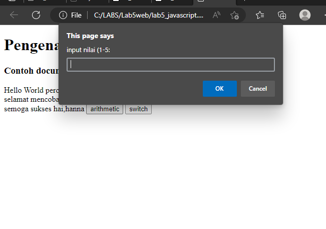
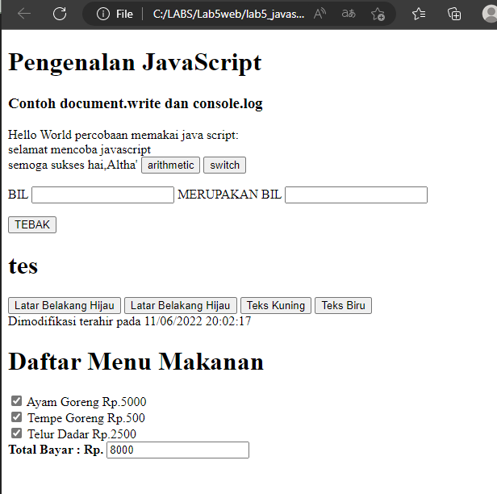

# Lab5web

<h2>Tampilan contoh javascript</h2> 

Berikut Hasilnya : 

<h2>Javascrip Dasar</h2>
Pemakaian Alert sebagai property window.

Berikut Hasilnya : 

<h2>Pemakaian Prompt</h2>
Pembuatan fungsi dan cara pemanggilannya

Berikut Hasilnya : 

<h2>Dasar Pemrograman Di Javascript</h2>
Operasi dasar aritmatika

Berikut Hasilnya : 

<h2> Penggunaan operator switch untuk seleksi kondisi </h2>
Pembuatan Form input dan button

Berikut Hasilnya : 

<h1>HTML DOM</h1>
Pilihan menggunakan checkBox dengan perhitungan otomatis

